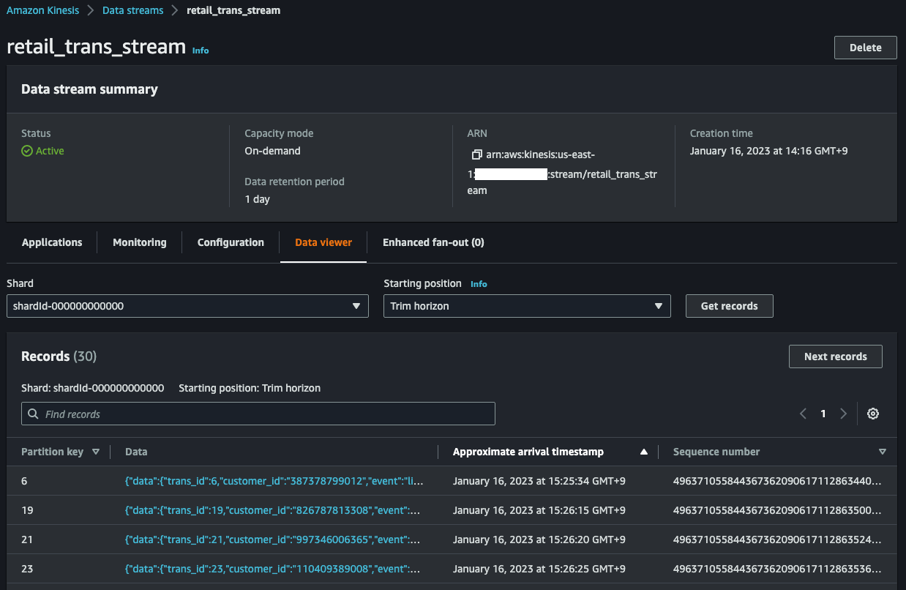

# Transactional Data Lake using Apache Iceberg with AWS Glue Streaming and DMS

This repository provides you cdk scripts and sample code on how to implement end to end data pipeline for transactional data lake by ingesting stream change data capture (CDC) from MySQL DB to Amazon S3 in Apache Iceberg format through Amazon Kinesis using Amazon Data Migration Service(DMS) and Glue Streaming.

## Stream CDC into an Amazon S3 data lake in Apache Iceberg format with AWS Glue Streaming and DMS

Below diagram shows what we are implementing.


The `cdk.json` file tells the CDK Toolkit how to execute your app.

This project is set up like a standard Python project.  The initialization
process also creates a virtualenv within this project, stored under the `.venv`
directory.  To create the virtualenv it assumes that there is a `python3`
(or `python` for Windows) executable in your path with access to the `venv`
package. If for any reason the automatic creation of the virtualenv fails,
you can create the virtualenv manually.

To manually create a virtualenv on MacOS and Linux:

```
$ python3 -m venv .venv
```

After the init process completes and the virtualenv is created, you can use the following
step to activate your virtualenv.

```
$ source .venv/bin/activate
```

If you are a Windows platform, you would activate the virtualenv like this:

```
% .venv\Scripts\activate.bat
```

Once the virtualenv is activated, you can install the required dependencies.

```
(.venv) $ pip install -r requirements.txt
```

To add additional dependencies, for example other CDK libraries, just add
them to your `setup.py` file and rerun the `pip install -r requirements.txt`
command.

## Prerequisites

Before synthesizing the CloudFormation,

-  **You set up Apache Iceberg connector for AWS Glue to use Apache Iceberg with AWS Glue jobs.** (For more information, see [References](#references) (2)). Then `glue_connections_name` of `cdk.context.json` configuration file should be set by Apache Iceberg connector name like this:
   <pre>
   { "glue_connections_name": "iceberg-connection" }
   </pre>

- **You create a S3 bucket for a glue job script and upload the glue job script file into the s3 bucket.** Then `glue_assets_s3_bucket_name` and `glue_job_script_file_name` of `cdk.context.json` configuration file should be set by the S3 bucket name and the glue job script file name like this:
   <pre>
   {
      "glue_assets_s3_bucket_name": "aws-glue-assets-123456789012-us-east-1",
      "glue_job_script_file_name": "spark_sql_merge_into_iceberg.py"
   }
   </pre>

Then you set other remaining configurations of the cdk context configuration file `cdk.context.json` accordingly.

For example:
<pre>
{
  "db_cluster_name": "dms-source-db",
  "db_secret_name": "dev/rds/admin",
  "dms_data_source": {
    "database_name": "testdb",
    "table_name": "retail_trans"
  },
  "kinesis_stream_name": "cdc_retail_trans_stream",
  "glue_assets_s3_bucket_name": "aws-glue-assets-123456789012-us-east-1",
  "glue_job_script_file_name": "spark_sql_merge_into_iceberg.py",
  "glue_job_name": "cdc_based_upsert_to_iceberg_table",
  "glue_job_input_arguments": {
    "--catalog": "job_catalog",
    "--database_name": "cdc_iceberg_demo_db",
    "--table_name": "retail_trans_iceberg",
    "--primary_key": "trans_id",
    "--kinesis_table_name": "cdc_retail_trans_stream",
    "--starting_position_of_kinesis_iterator": "LATEST",
    "--iceberg_s3_path": "s3://glue-iceberg-demo-us-east-1/cdc_iceberg_demo_db/retail_trans_iceberg",
    "--lock_table_name": "iceberg_lock",
    "--aws_region": "us-east-1",
    "--window_size": "100 seconds",
    "--extra-jars": "s3://aws-glue-assets-123456789012-us-east-1/extra-jars/aws-sdk-java-2.17.224.jar",
    "--user-jars-first": "true"
  },
  "glue_connections_name": "iceberg-connection",
  "glue_kinesis_table": {
    "database_name": "cdc_iceberg_demo_db",
    "table_name": "cdc_retail_trans_stream"
  }
}
</pre>

:information_source: `--primary_key` of `glue_job_input_arguments` should be set by Iceberg table's primary column name. So, it is better to set the primary key of RDS table.

:information_source: `--extra-jars` and `--user-jars-first` of `glue_job_input_arguments` is used in the 4th step of [Set up Glue Streaming Job](#set-up-glue-streaming-job).

At this point you can now synthesize the CloudFormation template for this code.

<pre>
(.venv) $ export CDK_DEFAULT_ACCOUNT=$(aws sts get-caller-identity --query Account --output text)
(.venv) $ export CDK_DEFAULT_REGION=$(curl -s 169.254.169.254/latest/dynamic/instance-identity/document | jq -r .region)
(.venv) $ cdk synth --all
</pre>

Now let's try to deploy.

## Creating Aurora MySQL cluster

1. :information_source: Create an AWS Secret for your RDS Admin user like this:
   <pre>
   (.venv) $ aws secretsmanager create-secret \
      --name <i>"your_db_secret_name"</i> \
      --description "<i>(Optional) description of the secret</i>" \
      --secret-string '{"username": "admin", "password": <i>"password_of_at_last_8_characters"</i>}'
   </pre>
   For example,
   <pre>
   (.venv) $ aws secretsmanager create-secret \
      --name "dev/rds/admin" \
      --description "admin user for rds" \
      --secret-string '{"username": "admin", "password": <i>"your admin password"</i>}'
   </pre>

2. Create an Aurora MySQL Cluster
   <pre>
   (.venv) $ cdk deploy TransactionalDataLakeVpc AuroraMysqlAsDMSDataSource
   </pre>

## Confirm that binary logging is enabled

<b><em>In order to set up the Aurora MySQL, you need to connect the Aurora MySQL cluster on either your local PC or a EC2 instance.</em></b>

1. (Optional) Create an EC2 Instance

   <pre>
    (.venv) $ cdk deploy AuroraMysqlBastionHost
   </pre>

2. Connect to the Aurora cluster writer node.
   <pre>
    $ sudo pip install ec2instanceconnectcli
    $ export BASTION_HOST_ID=$(aws cloudformation describe-stacks --stack-name <i>AuroraMysqlBastionHost</i> | jq -r '.Stacks[0].Outputs | .[] | select(.OutputKey | endswith("EC2InstanceId")) | .OutputValue')
    $ mssh --region "<i>your-region-name (e.g., us-east-1)</i>" ec2-user@${BASTION_HOST_ID}
    [ec2-user@ip-172-31-7-186 ~]$ mysql -h<i>db-cluster-name</i>.cluster-<i>xxxxxxxxxxxx</i>.<i>region-name</i>.rds.amazonaws.com -uadmin -p
    Enter password:
    Welcome to the MariaDB monitor.  Commands end with ; or \g.
    Your MySQL connection id is 20
    Server version: 8.0.23 Source distribution

    Copyright (c) 2000, 2018, Oracle, MariaDB Corporation Ab and others.

    Type 'help;' or '\h' for help. Type '\c' to clear the current input statement.

    MySQL [(none)]>
   </pre>

   > :information_source: `AuroraMysqlBastionHost` is a CDK Stack to create the bastion host.

   > :information_source: You can also connect to an EC2 instance using the EC2 Instance Connect CLI.
   For more information, see [Connect using the EC2 Instance Connect CLI](https://docs.aws.amazon.com/AWSEC2/latest/UserGuide/ec2-instance-connect-methods.html#ec2-instance-connect-connecting-ec2-cli).
   For example,
       <pre>
       $ sudo pip install ec2instanceconnectcli
       $ mssh ec2-user@i-001234a4bf70dec41EXAMPLE # ec2-instance-id
       </pre>

3. At SQL prompt run the below command to confirm that binary logging is enabled:
   <pre>
    MySQL [(none)]> SHOW GLOBAL VARIABLES LIKE "log_bin";
    +---------------+-------+
    | Variable_name | Value |
    +---------------+-------+
    | log_bin       | ON    |
    +---------------+-------+
    1 row in set (0.00 sec)
   </pre>

4. Also run this to AWS DMS has bin log access that is required for replication
   <pre>
    MySQL [(none)]> CALL mysql.rds_set_configuration('binlog retention hours', 24);
    Query OK, 0 rows affected (0.01 sec)
   </pre>

## Create a sample database and table

1. Run the below command to create the sample database named `testdb`.
   <pre>
    MySQL [(none)]> SHOW DATABASES;
    +--------------------+
    | Database           |
    +--------------------+
    | information_schema |
    | mysql              |
    | performance_schema |
    | sys                |
    +--------------------+
    4 rows in set (0.00 sec)

    MySQL [(none)]> CREATE DATABASE IF NOT EXISTS testdb;
    Query OK, 1 row affected (0.01 sec)

    MySQL [(none)]> USE testdb;
    Database changed
    MySQL [testdb]> SHOW tables;
    Empty set (0.00 sec)
   </pre>
2. Also run this to create the sample table named `retail_trans`
   <pre>
    MySQL [testdb]> CREATE TABLE IF NOT EXISTS testdb.retail_trans (
              trans_id BIGINT(20) AUTO_INCREMENT,
              customer_id VARCHAR(12) NOT NULL,
              event VARCHAR(10) DEFAULT NULL,
              sku VARCHAR(10) NOT NULL,
              amount INT DEFAULT 0,
              device VARCHAR(10) DEFAULT NULL,
              trans_datetime DATETIME DEFAULT CURRENT_TIMESTAMP,
              PRIMARY KEY(trans_id),
              KEY(trans_datetime)
           ) ENGINE=InnoDB AUTO_INCREMENT=0;
    Query OK, 0 rows affected, 1 warning (0.04 sec)

    MySQL [testdb]> SHOW tables;
    +------------------+
    | Tables_in_testdb |
    +------------------+
    | retail_trans     |
    +------------------+
    1 row in set (0.00 sec)

    MySQL [testdb]> DESC retail_trans;
    +----------------+-------------+------+-----+-------------------+-------------------+
    | Field          | Type        | Null | Key | Default           | Extra             |
    +----------------+-------------+------+-----+-------------------+-------------------+
    | trans_id       | bigint      | NO   | PRI | NULL              | auto_increment    |
    | customer_id    | varchar(12) | NO   |     | NULL              |                   |
    | event          | varchar(10) | YES  |     | NULL              |                   |
    | sku            | varchar(10) | NO   |     | NULL              |                   |
    | amount         | int         | YES  |     | 0                 |                   |
    | device         | varchar(10) | YES  |     | NULL              |                   |
    | trans_datetime | datetime    | YES  | MUL | CURRENT_TIMESTAMP | DEFAULT_GENERATED |
    +----------------+-------------+------+-----+-------------------+-------------------+
    7 rows in set (0.00 sec)

    MySQL [testdb]>
   </pre>

<b><em>After setting up the Aurora MySQL, you should come back to the terminal where you are deploying stacks.</em></b>

## Create Amazon Kinesis Data Streams for AWS DMS target endpoint

  <pre>
  (.venv) $ cdk deploy DMSTargetKinesisDataStream
  </pre>

## Create AWS DMS Replication Task
  In the previous step we already we already created the sample database (i.e., `testdb`) and table (i.e., `retail_trans`)

  Now let's create a migration task.
  <pre>
  (.venv) $ cdk deploy DMSRequiredIAMRolesStack DMSTaskAuroraMysqlToKinesis
  </pre>

## Set up Glue Streaming Job
1. Make sure **Apache Iceberg connector for AWS Glue** ready to use Apache Iceberg with AWS Glue jobs.
2. Create a S3 bucket for Apache Iceberg table
   <pre>
   (.venv) $ cdk deploy GlueStreamingCDCtoIcebergS3Path
   </pre>
3. Define a schema for the streaming data
   <pre>
   (.venv) $ cdk deploy GlueTableSchemaOnKinesisStream
   </pre>

   Running `cdk deploy GlueTableSchemaOnKinesisStream` command is like that we create a schema manually using the AWS Glue Data Catalog as the following steps:

   (1) On the AWS Glue console, choose **Data Catalog**.<br/>
   (2) Choose **Databases**, and click **Add database**.<br/>
   (3) Create a database with the name `cdc_iceberg_demo_db`.<br/>
   (4) On the **Data Catalog** menu, Choose **Tables**, and click **Add Table**.<br/>
   (5) For the table name, enter `cdc_retail_trans_stream`.<br/>
   (6) Select `cdc_iceberg_demo_db` as a database.<br/>
   (7) Choose **Kinesis** as the type of source.<br/>
   (8) Enter the name of the stream.<br/>
   (9) For the classification, choose **JSON**.<br/>
   (10) Choose **Finish**

4. Upload **AWS SDK for Java 2.x** jar file into S3
   <pre>
   (.venv) $ wget https://repo1.maven.org/maven2/software/amazon/awssdk/aws-sdk-java/2.17.224/aws-sdk-java-2.17.224.jar
   (.venv) $ aws s3 cp aws-sdk-java-2.17.224.jar s3://aws-glue-assets-123456789012-atq4q5u/extra-jars/aws-sdk-java-2.17.224.jar
   </pre>
   A Glue Streaming Job might fail because of the following error:
   <pre>
   py4j.protocol.Py4JJavaError: An error occurred while calling o135.start.
   : java.lang.NoSuchMethodError: software.amazon.awssdk.utils.SystemSetting.getStringValueFromEnvironmentVariable(Ljava/lang/String;)Ljava/util/Optional
   </pre>
   We can work around the problem by starting the Glue Job with the additional parameters:
   <pre>
   --extra-jars <i>s3://path/to/aws-sdk-for-java-v2.jar</i>
   --user-jars-first true
   </pre>
   In order to do this, we might need to upload **AWS SDK for Java 2.x** jar file into S3.
5. Create Glue Streaming Job

   * (step 1) Select one of Glue Job Scripts and upload into S3
     <pre>
     (.venv) $ ls src/main/python/
      spark_sql_merge_into_iceberg.py
     (.venv) $ aws s3 mb <i>s3://aws-glue-assets-123456789012-atq4q5u</i> --region <i>us-east-1</i>
     (.venv) $ aws s3 cp src/main/python/spark_sql_merge_into_iceberg.py <i>s3://aws-glue-assets-123456789012-atq4q5u/scripts/</i>
     </pre>

   * (step 2) Provision the Glue Streaming Job

     <pre>
     (.venv) $ cdk deploy GlueStreamingCDCtoIcebergJobRole \
                          GrantLFPermissionsOnGlueJobRole \
                          GlueStreamingCDCtoIceberg
     </pre>
6. Make sure the glue job to access the Kinesis Data Streams table in the Glue Catalog database, otherwise grant the glue job to permissions

   Wec can get permissions by running the following command:
   <pre>
   (.venv) $ aws lakeformation list-permissions | jq -r '.PrincipalResourcePermissions[] | select(.Principal.DataLakePrincipalIdentifier | endswith(":role/GlueStreamingJobRole-Iceberg"))'
   </pre>
   If not found, we need manually to grant the glue job to required permissions by running the following command:
   <pre>
   (.venv) $ aws lakeformation grant-permissions \
               --principal DataLakePrincipalIdentifier=arn:aws:iam::<i>{account-id}</i>:role/<i>GlueStreamingJobRole-Iceberg</i> \
               --permissions SELECT DESCRIBE ALTER INSERT DELETE \
               --resource '{ "Table": {"DatabaseName": "<i>cdc_iceberg_demo_db</i>", "TableWildcard": {}} }'
   </pre>

## Create a table with partitioned data in Amazon Athena

Go to [Athena](https://console.aws.amazon.com/athena/home) on the AWS Management console.<br/>
* (step 1) Create a database

   In order to create a new database called `cdc_iceberg_demo_db`, enter the following statement in the Athena query editor and click the **Run** button to execute the query.

   <pre>
   CREATE DATABASE IF NOT EXISTS cdc_iceberg_demo_db;
   </pre>

* (step 2) Create a table

   Copy the following query into the Athena query editor, replace the `xxxxxxx` in the last line under `LOCATION` with the string of your S3 bucket, and execute the query to create a new table.
   <pre>
   CREATE TABLE cdc_iceberg_demo_db.retail_trans_iceberg (
      trans_id int,
      customer_id string,
      event string,
      sku string,
      amount int,
      device string,
      trans_datetime timestamp
   )
   PARTITIONED BY (`event`)
   LOCATION 's3://glue-iceberg-demo-xxxxxxx/cdc_iceberg_demo_db/retail_trans_iceberg'
   TBLPROPERTIES (
      'table_type'='iceberg'
   );
   </pre>
   If the query is successful, a table named `retail_trans_iceberg` is created and displayed on the left panel under the **Tables** section.

   If you get an error, check if (a) you have updated the `LOCATION` to the correct S3 bucket name, (b) you have mydatabase selected under the Database dropdown, and (c) you have `AwsDataCatalog` selected as the **Data source**.

   :information_source: If you fail to create the table, give Athena users access permissions on `cdc_iceberg_demo_db` through [AWS Lake Formation](https://console.aws.amazon.com/lakeformation/home), or you can grant anyone using Athena to access `cdc_iceberg_demo_db` by running the following command:
   <pre>
   (.venv) $ aws lakeformation grant-permissions \
                 --principal DataLakePrincipalIdentifier=arn:aws:iam::<i>{account-id}</i>:user/<i>example-user-id</i> \
                 --permissions CREATE_TABLE DESCRIBE ALTER DROP \
                 --resource '{ "Database": { "Name": "<i>cdc_iceberg_demo_db</i>" } }'
   (.venv) $ aws lakeformation grant-permissions \
                 --principal DataLakePrincipalIdentifier=arn:aws:iam::<i>{account-id}</i>:user/<i>example-user-id</i> \
                 --permissions SELECT DESCRIBE ALTER INSERT DELETE DROP \
                 --resource '{ "Table": {"DatabaseName": "<i>cdc_iceberg_demo_db</i>", "TableWildcard": {}} }'
   </pre>

## Run Test

1. Start the DMS Replication task by replacing the ARN in below command.
   <pre>
   (.venv) $ aws dms start-replication-task --replication-task-arn <i>dms-task-arn</i> --start-replication-task-type start-replication
   </pre>

2. Run glue job to load data from Kinesis Data Streams into S3
   <pre>
   (.venv) $ aws glue start-job-run --job-name <i>cdc_based_upsert_to_iceberg_table</i>
   </pre>

3. Generate test data.
   <pre>
    $ export BASTION_HOST_ID=$(aws cloudformation describe-stacks --stack-name <i>AuroraMysqlBastionHost</i> | jq -r '.Stacks[0].Outputs | .[] | select(.OutputKey | endswith("EC2InstanceId")) | .OutputValue')
    $ mssh --region "<i>your-region-name (e.g., us-east-1)</i>" ec2-user@${BASTION_HOST_ID}
    [ec2-user@ip-172-31-7-186 ~]$ pip3 install -r utils/requirements-dev.txt
    [ec2-user@ip-172-31-7-186 ~]$ python3 utils/gen_fake_mysql_data.py \
                                    --database <i>your-database-name</i> \
                                    --table <i>your-table-name</i> \
                                    --user <i>user-name</i> \
                                    --password <i>password</i> \
                                    --host <i>db-cluster-name</i>.cluster-<i>xxxxxxxxxxxx</i>.<i>region-name</i>.rds.amazonaws.com \
                                    --max-count 10
   </pre>
   In the Data Viewer in the Amazon Kinesis Management Console, you can see incomming records.
   

   After filling data into the MySQL table, connect to the Aurora cluster writer node and run some DML(insert, update, delete) queries.

   For example, update some records.
   <pre>
    $ mysql -h<i>db-cluster-name</i>.cluster-<i>xxxxxxxxxxxx</i>.<i>region-name</i>.rds.amazonaws.com -uadmin -p
    Enter password:
    Welcome to the MariaDB monitor.  Commands end with ; or \g.
    Your MySQL connection id is 20
    Server version: 8.0.23 Source distribution

    Copyright (c) 2000, 2018, Oracle, MariaDB Corporation Ab and others.

    Type 'help;' or '\h' for help. Type '\c' to clear the current input statement.

    MySQL [(none)]> USE testdb;
    Database changed

    MySQL [testdb]> SELECT * FROM retail_trans LIMIT 10;
    +----------+--------------+----------+------------+--------+--------+---------------------+
    | trans_id | customer_id  | event    | sku        | amount | device | trans_datetime      |
    +----------+--------------+----------+------------+--------+--------+---------------------+
    |        1 | 460104780596 | cart     | IQ6879MMTB |      8 | mobile | 2023-01-16 06:08:06 |
    |        2 | 758933025159 | like     | RL1573WWLT |      1 | tablet | 2023-01-16 06:17:21 |
    |        3 | 754384589074 | like     | PX4135DYNT |      1 | mobile | 2023-01-16 06:08:52 |
    |        4 | 602811489876 | purchase | PI7913TREO |     66 | pc     | 2023-01-16 06:01:07 |
    |        5 | 222732129586 | like     | AS6987HGLN |      1 | mobile | 2023-01-16 06:09:06 |
    |        6 | 387378799012 | list     | AI6161BEFX |      1 | pc     | 2023-01-16 06:10:27 |
    |        7 | 843982894991 | cart     | DA7930CJBR |     81 | pc     | 2023-01-16 06:11:41 |
    |        8 | 818177069814 | like     | JS6166YPTE |      1 | pc     | 2023-01-16 06:17:08 |
    |        9 | 248083404876 | visit    | AS8552DVOO |      1 | pc     | 2023-01-16 06:24:39 |
    |       10 | 731184658511 | visit    | XZ9997LSJN |      1 | tablet | 2023-01-16 06:12:18 |
    +----------+--------------+----------+------------+--------+--------+---------------------+
    10 rows in set (0.00 sec)

    MySQL [testdb]> UPDATE retail_trans SET amount = 3 WHERE trans_id=6;
    Query OK, 1 rows affected (0.00 sec)
    Rows matched: 1  Changed: 1  Warnings: 0

    MySQL [testdb]> UPDATE retail_trans SET amount = 39 WHERE trans_id=19;
    Query OK, 1 rows affected (0.00 sec)
    Rows matched: 1  Changed: 1  Warnings: 0

    MySQL [testdb]> UPDATE retail_trans SET amount = 60 WHERE trans_id=21;
    Query OK, 1 rows affected (0.00 sec)
    Rows matched: 1  Changed: 1  Warnings: 0

    MySQL [testdb]> UPDATE retail_trans SET amount = 4 WHERE trans_id=23;
    Query OK, 1 rows affected (0.00 sec)
    Rows matched: 1  Changed: 1  Warnings: 0

    MySQL [testdb]> UPDATE retail_trans SET amount = 42 WHERE trans_id=24;
    Query OK, 1 rows affected (0.00 sec)
    Rows matched: 1  Changed: 1  Warnings: 0
   </pre>

   Delete some records.
   <pre>
    MySQL [testdb]> DELETE FROM retail_trans WHERE trans_id=6;
    Query OK, 1 rows affected (0.00 sec)

    MySQL [testdb]> DELETE FROM retail_trans WHERE trans_id=33;
    Query OK, 1 rows affected (0.00 sec)

    MySQL [testdb]> DELETE FROM retail_trans WHERE trans_id=23;
    Query OK, 1 rows affected (0.00 sec)
   </pre>

   Insert some new records.
   <pre>
    MySQL [testdb]> INSERT INTO retail_trans (customer_id, event, sku, amount, device) VALUES
    -> ("818177069814", "like", "JS6166YPTE", 1, "mobile"),
    -> ("387378799012", "list", "AI6161BEFX", 1, "pc"),
    -> ("839828949919", "purchase", "AC2306JBRJ", 5, "tablet"),
    -> ("248083404876", "visit", "AS8552DVOO", 1, "pc"),
    -> ("731184658511", "like", "XZ9997LSJN", 1, "tablet");
    Query OK, 5 rows affected (0.00 sec)
    Records: 5  Duplicates: 0  Warnings: 0
   </pre>

4. Check streaming data in S3

   After `3~5` minutes, you can see that the streaming data have been delivered from **Kinesis Data Streams** to **S3**.

   
   
   
   

5. Run test query using Amazon Athena

   Enter the following SQL statement and execute the query.
   <pre>
   SELECT COUNT(*)
   FROM cdc_iceberg_demo_db.retail_trans_iceberg;
   </pre>

## Clean Up

1. Stop the DMS Replication task by replacing the ARN in below command.
   <pre>
   (.venv) $ aws dms stop-replication-task --replication-task-arn <i>dms-task-arn</i>
   </pre>

2. Stop the glue job by replacing the job name in below command.
   <pre>
   (.venv) $ JOB_RUN_IDS=$(aws glue get-job-runs \
               --job-name <i>cdc_based_upsert_to_iceberg_table</i> | jq -r '.JobRuns[] | select(.JobRunState=="RUNNING") | .Id' \
               | xargs)
   (.venv) $ aws glue batch-stop-job-run \
               --job-name <i>cdc_based_upsert_to_iceberg_table</i> \
               --job-run-ids $JOB_RUN_IDS
   </pre>

3. Delete the CloudFormation stack by running the below command.
   <pre>
   (.venv) $ cdk destroy --all
   </pre>

## Useful commands

 * `cdk ls`          list all stacks in the app
 * `cdk synth`       emits the synthesized CloudFormation template
 * `cdk deploy`      deploy this stack to your default AWS account/region
 * `cdk diff`        compare deployed stack with current state
 * `cdk docs`        open CDK documentation

Enjoy!

## References

 * (1) [AWS Glue versions](https://docs.aws.amazon.com/glue/latest/dg/release-notes.html): The AWS Glue version determines the versions of Apache Spark and Python that AWS Glue supports.
 * (2) [Use the AWS Glue connector to read and write Apache Iceberg tables with ACID transactions and perform time travel \(2022-06-21\)](https://aws.amazon.com/ko/blogs/big-data/use-the-aws-glue-connector-to-read-and-write-apache-iceberg-tables-with-acid-transactions-and-perform-time-travel/)
 * (3) [aws-samples/aws-dms-cdc-data-pipeline](https://github.com/aws-samples/aws-dms-cdc-data-pipeline) - Data Pipeline for CDC data from MySQL DB to Amazon OpenSearch Service through Amazon Kinesis using Amazon Data Migration Service(DMS)
 * (4) [How to troubleshoot binary logging errors that I received when using AWS DMS with Aurora MySQL as the source?(Last updated: 2019-10-01)](https://aws.amazon.com/premiumsupport/knowledge-center/dms-binary-logging-aurora-mysql/)
 * (5) [AWS DMS - Using Amazon Kinesis Data Streams as a target for AWS Database Migration Service](https://docs.aws.amazon.com/dms/latest/userguide/CHAP_Target.Kinesis.html)
 * (6) [Specifying task settings for AWS Database Migration Service tasks](https://docs.aws.amazon.com/dms/latest/userguide/CHAP_Tasks.CustomizingTasks.TaskSettings.html#CHAP_Tasks.CustomizingTasks.TaskSettings.Example)
 * (7) [Using Data Viewer in the Kinesis Console](https://docs.aws.amazon.com/streams/latest/dev/data-viewer.html)
 * (8) [Amazon Athena Using Iceberg tables](https://docs.aws.amazon.com/athena/latest/ug/querying-iceberg.html)
 * (9) [Implement a CDC-based UPSERT in a data lake using Apache Iceberg and AWS Glue (2022-06-15)](https://aws.amazon.com/ko/blogs/big-data/implement-a-cdc-based-upsert-in-a-data-lake-using-apache-iceberg-and-aws-glue/)
 * (10) [Apache Iceberg - Spark Writes with SQL (v0.14.0)](https://iceberg.apache.org/docs/0.14.0/spark-writes/)
 * (11) [Crafting serverless streaming ETL jobs with AWS Glue (2020-10-14)](https://aws.amazon.com/ko/blogs/big-data/crafting-serverless-streaming-etl-jobs-with-aws-glue/)
 * (12) [AWS Glue Notebook Samples](https://github.com/aws-samples/aws-glue-samples/tree/master/examples/notebooks) - sample iPython notebook files which show you how to use open data dake formats; Apache Hudi, Delta Lake, and Apache Iceberg on AWS Glue Interactive Sessions and AWS Glue Studio Notebook.
 * (13) [Identity and access management for AWS Database Migration Service](https://docs.aws.amazon.com/dms/latest/userguide/security-iam.html#CHAP_Security.APIRole)
 * (14) [How AWS DMS handles open transactions when starting a full load and CDC task (2022-12-26)](https://aws.amazon.com/blogs/database/how-aws-dms-handles-open-transactions-when-starting-a-full-load-and-cdc-task/)
 * (15) [AWS DMS key troubleshooting metrics and performance enhancers (2023-02-10)](https://aws.amazon.com/blogs/database/aws-dms-key-troubleshooting-metrics-and-performance-enhancers/)
 * (16) [Choosing an open table format for your transactional data lake on AWS (2023-06-09)](https://aws.amazon.com/blogs/big-data/choosing-an-open-table-format-for-your-transactional-data-lake-on-aws/)

## Troubleshooting

 * Granting database or table permissions error using AWS CDK
   * Error message:
     <pre>
     AWS::LakeFormation::PrincipalPermissions | CfnPrincipalPermissions Resource handler returned message: "Resource does not exist or requester is not authorized to access requested permissions. (Service: LakeFormation, Status Code: 400, Request ID: f4d5e58b-29b6-4889-9666-7e38420c9035)" (RequestToken: 4a4bb1d6-b051-032f-dd12-5951d7b4d2a9, HandlerErrorCode: AccessDenied)
     </pre>
   * Solution:

     The role assumed by cdk is not a data lake administrator. (e.g., `cdk-hnb659fds-deploy-role-12345678912-us-east-1`) <br/>
     So, deploying PrincipalPermissions meets the error such as:

     `Resource does not exist or requester is not authorized to access requested permissions.`

     In order to solve the error, it is necessary to promote the cdk execution role to the data lake administrator.<br/>
     For example, https://github.com/aws-samples/data-lake-as-code/blob/mainline/lib/stacks/datalake-stack.ts#L68

   * Reference:

     [https://github.com/aws-samples/data-lake-as-code](https://github.com/aws-samples/data-lake-as-code) - Data Lake as Code

 * `dms-vpc-role` is not configured properly: When first trying to deploy a DMS instance to an account using `aws-dms.CfnReplicationInstance()` the following error might occur:
   * Error message:
     <pre>
     | CREATE_FAILED | AWS::DMS::ReplicationInstance  |
     Instance The IAM Role arn:aws:iam::123412341234:role/dms-vpc-role is not configured properly. (Service: AWSDatabaseMigrationService; Status Code: 400; Error Code: AccessDeniedFault; Request ID: 39cbef67-2365-4f1e-89c9-e3704c35481b)
     </pre>
   * Solution:

     If you use the AWS CLI or the AWS DMS API for your database migration, you must add three IAM roles to your AWS account before you can use the features of AWS DMS. Two of these are `dms-vpc-role` and `dms-cloudwatch-logs-role`. If you use Amazon Redshift as a target database, you must also add the IAM role `dms-access-for-endpoint` to your AWS account.

     Check out the following reference document to create the IAM roles.

   * Reference:

     [Creating the IAM roles to use with the AWS CLI and AWS DMS API](https://docs.aws.amazon.com/dms/latest/userguide/security-iam.html#CHAP_Security.APIRole)

## Security

See [CONTRIBUTING](CONTRIBUTING.md#security-issue-notifications) for more information.

## License

This library is licensed under the MIT-0 License. See the LICENSE file.

